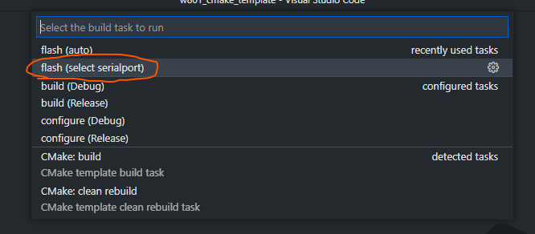
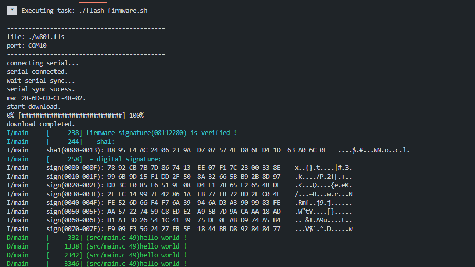

# W801 VSCode CMake template

HLK-W801 Vscode 项目模板，使用 `VSCode + CMake + Ninja` 构建

本处使用的开发板为 `HLK-W801-KIT-V1.1`

> 注意：该仓库内的 SDK 有一定的改动，可能与官方的有出入

## 安装

- 安装 CMake v3.20+ 以及 Ninja

  - 打开系统的 cmd，执行 `cmake --help` 和 `ninja --help` 检查是否已安装完成

- 克隆源码，在 VSCode 中打开工程文件夹：

  - 在当前工作区打开终端，执行 `git submodule init` 和 `git submodule update`，拉取子模块

- 安装 csky 编译器（系统中已安装则可忽略该步骤）：

  - 打开工程的目录：`tools/w800/toolchain/`

  - 将 `csky-elfabiv2-tools-mingw-minilibc-20210423.7z` 编译器解压，将解压后的目录移动到你的磁盘其他位置上

  - 打开系统属性->高级->环境变量设置，将解压后编译器的路径 `xxx\xx\csky-elfabiv2-tools-mingw-minilibc-20210423\bin` 设置到环境变量 `Path` 中

  - 保存设置，之后关闭所有 VSCode 实例

- 再次打开 VSCode，打开工程的目录，在终端中执行 `csky-elfabiv2-gcc -v` 检查编译器是否已安装

- 安装 VSCode 插件：`CMake Tools`

***

## 编译

- 打开 CMake Tools 的工具栏

- 选择 `Configure All Projects` 生成配置

- 选择 `Build All Projects` 启动构建

- 编译完成后，工程根目录下会生成一个 `bin` 文件夹，固件将存放在其中

***

## 烧录

- 按下 `ctrl+shift+B` 打开可用任务，选择 `flash (auto)` 回车，将自动选择串口，并启动烧录

  

- 烧录结束后，按下复位键启动程序，将打印如下 log

  