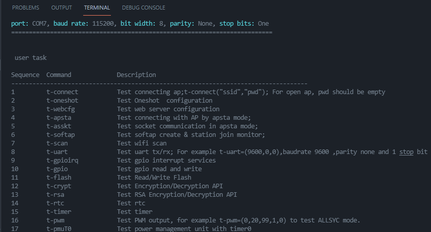
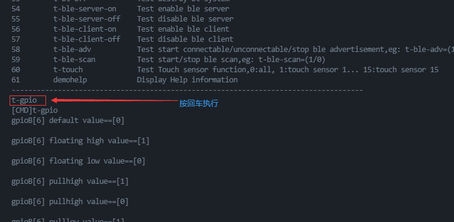

# W801 vscode demo

HLK-W801 Vscode 项目模板，使用 eide 作为开发环境

本处使用的开发板为 `HLK-W801-KIT-V1.0`

## 安装

- 下载并解压编译器至某目录，并将 **csky-elfabiv2-gcc.exe** 路径**设置到系统环境变量**: [csky-elfabiv2-tools-mingw-minilibc-20210423.7z](https://cloud.github0null.io/api/v3/file/get/712/csky-elfabiv2-tools-mingw-minilibc-20210423.7z?sign=VIVH_bCv-_Han_BnRua9DA5DRmdjsVIavFEqryVnVqI%3D%3A0)

- 在 VSCode 中打开插件商店，搜索并安装 **Embedded IDE (eide)**

- 下载并解压该仓库，双击 `w801_eide_template.code-workspace` 文件打开项目工作区即可加载项目

***

## 编译

按下快捷键 `F7` 即可进行编译

> 若提示 **无法找到编译器的安装位置**，请点击 `设置工具链路径` 功能, 选择 `ANY GCC Toolchain`，将 `csky-elfabiv2` 的安装位置设置一下即可（安装目录是指包含有 `bin` 目录的文件夹） 

***

## 烧录

- 连接开发板，在设备管理器中查看开发板的**串口号**

- 打开 **项目设置** -> **环境变量**，设置 `FLASH_PORT` 变量的值为开发板的串口号 (COMX)

- 按下快捷键 `ctrl+shift+d` 开始烧录

  

> 若电脑只连接了一个串口设备，可跳过 **设置串口号** 的步骤，烧录命令会自动选择串口

***

## 测试

点击 vscode 状态栏的 **波特率** 按钮设置波特率为 **115200**, 点击 **串口监视器** 按钮打开串口

按下开发板上的 `Reset` 按钮，终端窗口将输出所有的测试命令：

在终端内输入某个测试命令，按回车可以直接执行相关测试

> Have fun ! :)
